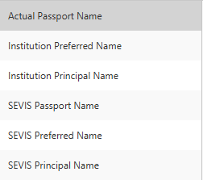

import Color from '../../../src/components/utilities/colors';

# J-1 Student Batching

:::info Full Attention
Batching requires full attention to checking, double checking and triple checking student information. This includes spelling checks, date checks and document checks. 
::: 

## What to open first
- PeopleSoft
- Onboarding Master List Monday Board
- Student's Passport
- Student's IWORK/Financial Aid Award
- Student's Sunapsis Account
- BYUH Codes for Major's Excel Document

Go to **"Workflow Management"**, inside **Inital DS-2019 Request** and ensure there are are 4 sections:

You will start batching in this order: \
*Dependant Information ⮕ Personal Information ⮕ Financial Information ⮕ Delivery Information*

:::tip Dependant Information
You can check the Student's **Maritial Status** in PeopleSoft under *personal information.*
::: 

------------------------------------------------------------------------------------

## DS-2019 Dependant Information

Click on DS-2019 **Dependant Information**, and if there are no dependents, "Approve" by clicking the green tick at the top. It is important that you do not send an email once you approve. Simply close the window when it pops up.

------------------------------------------------------------------------------------------------------------

## DS-2019 Personal Information

Click on DS-2019 **Personal Information**. If you haven't opened their passport page you can do so now. Click on **Apply Template** (the blue arrow in the toolbar) and select *Personal Information*. You will be prompted 2 times; simply click "YES" both times and apply the template. When a list of items show up, click "CTRL + A" to select all and apply. 

:::tip Returning Student
If the student is a returning student or a cancellation student from a previous semester, check their information in **"Record Management"** before proceeding
::: 

Start by going in order of the tabs openned: \
*Core Biographical ⮕ Communication ⮕ Addresses ⮕ Passport ⮕ etc*

**PLACEHOLDER PUT GIF HERE!!!**

------------------------------------------------------------------------------------------------------------

### Core Biographical
- Set Program Status: **J-1**
- Set Immigration Status: **J-1 Exchange Visitor**
- Save! 

:::warning Check Student ID
Ensure that the student's **program status, citizenship and NetworkID** is accurate. Cross-reference with the respective monday board.
::: 

------------------------------------------------------------------------------------------------------------

### Communication
- Set US Phone number as <Color shade="--copy-paste-color">**8086753516**</Color>
- Save!

------------------------------------------------------------------------------------------------------------

### Addresses
<u>1. Foreign Address</u>
- The template automatically applies their Foreign address in this field, simply **duplicate** their foreign address and change it's type to **MAILING ADDRESS**.

<u>2. Mailing Address</u>
- Ensure information is identical to Foreign Address

<u>3. SEVIS US Residential Address & Mailing Address</u>
- Click the Green + at the toolbar \

- Choose **Type: SEVIS US Residential Address**
- Address:
  <Color shade="--copy-paste-color">
  - **55-220 KULANUI ST** 
  - **LAIE**
  - **HI**
  - **96762**
  - **UNITED STATES**
  </Color>
- Once done copy-pasting, duplicate SEVIS US Residential Address \

- Add Street 2:
    - <Color shade="--copy-paste-color">**Bldg 5**</Color>
- Save!

Once you finish, there should be 4 sections \

------------------------------------------------------------------------------------------------------------

### Passport
- Enter **Passport Country**, cross reference with Passport submitted by student (Remember to remove any spaces before saving!)
- Verify Passport Number with Passport PDF
- Verify Issue Date and Expiration Date
- Save!

:::tip Dates
Some countries go by DD/MM/YYYY or even YYYY/MM/DD. please verify the passport information via MRZ or through passport information
::: 

------------------------------------------------------------------------------------------------------------

### Name Management
- Use MRZ (Machine-Readable Zone) on passport.  
- Enter names exactly as shown (after country code).  
- **ALL CAPS**, **no special characters or dashes**.

**Name Type Sequence**
1. Actual Passport Name → **Save** → **Duplicate**
2. Institution Preferred Name → Save → Duplicate  
3. Institution Principal Name → Save → Duplicate  
4. SEVIS Passport Name  
   - Paste first name **after** last name  
   - Save → Duplicate  
5. SEVIS Preferred Name  
   - Cut first displayed name (last name) and paste **after** given name  
   - Save → Duplicate  
6. SEVIS Principal Name  
   - Copy/paste correct names into fields  
   - Save

Once you finish, there should be **6 Sections** \

------------------------------------------------------------------------------------------------------------

### Extended Biographical 
- Select **Gender** (Male/Female).  
- Select **SEVIS Sex**(Male/Female).  
- Verify remaining fields.  
- Set:  
  - **Citizenship Status: Native**  
  - **Residency: Resident**
  - **Marital Status: From PeopleSoft**  
- Click **Save**.

Once all information has been verified, simply go back to **"Initial DS-2019 Request Form"**, click **"Personal Information"** and click the <Color shade="--green-checkmark">**GREEN CHECK**</Color>

------------------------------------------------------------------------------------------------------------

## DS-2019 Financial Information
- Click DS-2019 Financial Information
- Apply template just like before, but this time choose DS-2019 Financial Information
- Open IWORK or PAS Scholarship Funding Letter if you have not opened it yet, it can be found in:
    - Document Management ⮕ Student Documents ⮕ Financial & Insurance ⮕ Finances

### IWORK 

- Please note to always **DOUBLE CHECK** this information
- The exact calculations are as follow:
    - Program Sponsor Funds: IWORK/yr 23000 x 4 years= <Color shade="--copy-paste-color">92,000 (stays the same for everyone)</Color> 

    - Personal Funds: Family Contribution 600 x 4 years = <Color shade="--changable-value">2400 </Color> (please calculate)!

    - <Color shade="--copy-paste-color">IWORK Student Employment</Color>: (150864 – 92000) = 58,864 - <Color shade="--changable-value">2400</Color> = 56464 (please calculate)!   

| Description               | Amount (4 years) ($) |
|---------------------------|------------|
| Total Cost of Attendance  | 150,864    |
| Program Sponsor Funds     | 92,000     |
| Personal Funds (Family)   | 2,400      |
| IWORK Student Employment  | 56,464     |

### Presidential/Full Scholarship

