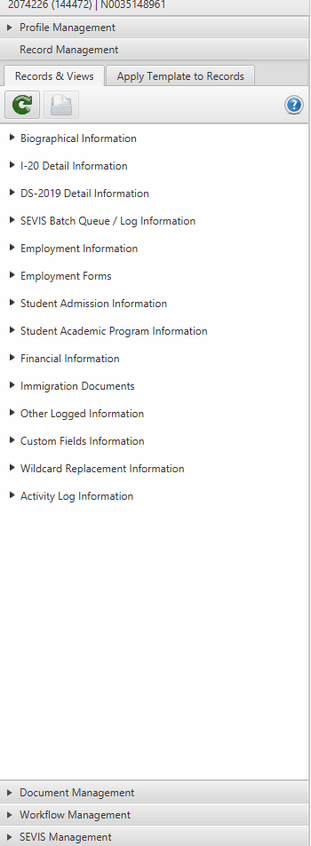
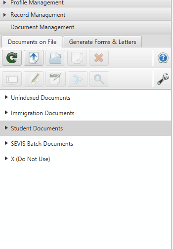

# Document Management

The sidebar in Sunapsis contains many categories that you should become familiar with. This section focuses on the Document Management area, which is one of the most commonly used features.

## Overview

The Document Management section contains all legal documents that students have submitted and that have been saved into our system. This is where you'll find scanned copies, PDFs, and images of official documentation.

## Immigration Documents

When you click on **Immigration Documents**, you'll see a dropdown menu displaying all documents submitted over the years, including:

- **Visa documents**
- **Passports**
- **I-94 forms**
- **DS-2019 forms** (for J-1 visa holders)
- **I-20 forms** (for F-1 visa holders)

These documents are organized chronologically, allowing you to track a student's immigration history throughout their time at the university.

## Student Documents

The **Student Documents** subsection contains non-immigration related files such as:

- Employment authorization forms
- Internship documentation
- Financial documents
- Supporting materials

## Unindexed Documents

Occasionally, you may encounter documents that don't fit neatly into the predefined categories. These are stored in the **Unindexed Documents** section and may include:

- Miscellaneous images
- Additional supporting documentation
- Correspondence
- Other materials that haven't been categorized

:::tip
If you find documents in the Unindexed section that should be properly categorized, consult with your advisor about the appropriate classification.
:::