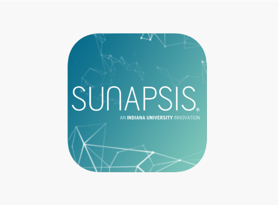

# Introduction to Sunapsis

Sunapsis is a widely used international case management software utilized by the International Student Services (ISS) department at BYU-Hawaii. The platform helps maintain accurate records of student information, track legal documentation, and assist students in maintaining compliance with university and immigration requirements.

## Purpose of This Documentation

This guide will help you, as a student worker, effectively utilize Sunapsis in your daily responsibilities. You'll become familiar with the essential tools at your disposal and understand your role in supporting international students.

## What You'll Learn

Throughout this documentation, you'll discover how to:

- Navigate student profiles and view critical information
- Search and retrieve student records efficiently
- Manage and review legal documents
- Document interactions with students
- Understand the various data categories within the system

Let's get started with the basics of viewing and managing student information.