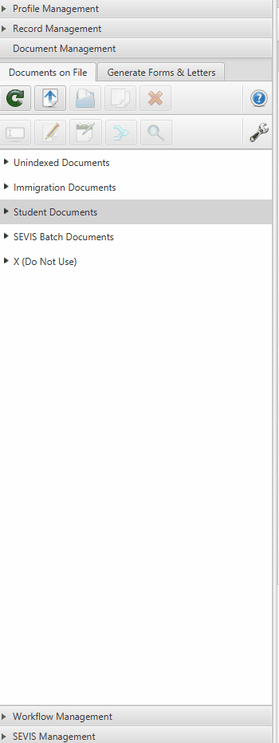
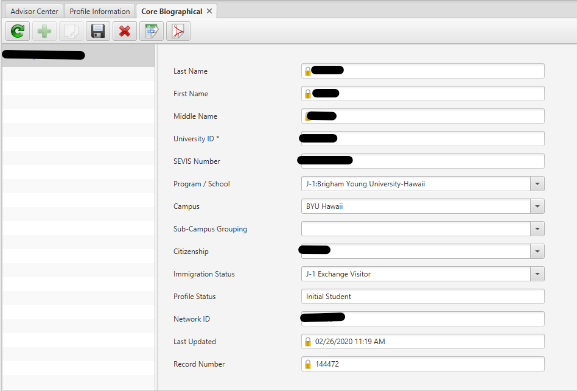
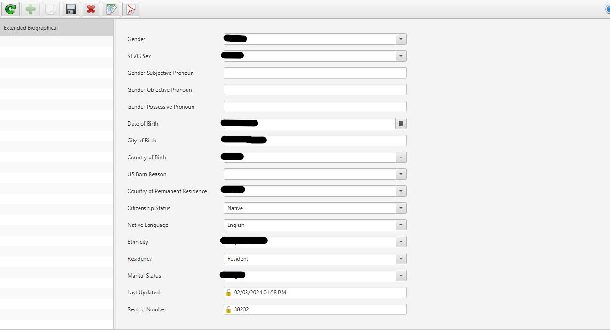
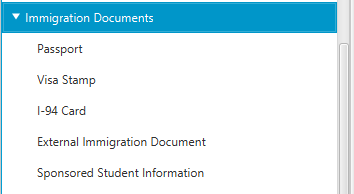

# Record Management

The Record Management section is where all student information is stored and maintained. Information here is organized into various subsections that can be viewed, added to, or deleted as needed.

:::danger Important
Exercise extreme caution when deleting any information. You must have express approval from advisors before removing any data. Even incorrect information may be intentionally retained in the system for documentation and data collection purposes.
:::

## Biographical Information

This subsection manages a student's core personal information.

### Core Biographical

Core Biographical encompases basic university identification information, some relevant categories are: 

- Name
- Student ID
- SEVIS number
- Citizenship
- Immigration status

### Extended Biographical

Extended Biographical goes a little deeper and will list more personal data relevant to teh individual, 
some sections are:

- Gender
- Date of Birth
- City of Birth
- Ethnicity
- Marital Status

### Name Management
The system maintains multiple name fields to accommodate various official documents:
- **Passport name**
- **Institution preferred name**
- **SEVIS passport name**
- **SEVIS preferred name**
- **SEVIS principal name**
- **Institution principal name**

### Other categories
- Dependents
- Addresses
- Contacts

## I-20 and DS-2019 Subsections

These two subsections are structurally identical but differ based on the student's visa type (F-1 uses I-20, J-1 uses DS-2019).

### Information Tracked
- **Course of study** - The student's academic program
- **Financial funding** - Funding sources and amounts
- **Site of activity** - The institution (BYU-Hawaii)
- **Training programs**:
  - Student Academic Training (for J-1 students)
  - Optional Practical Training (OPT) (for F-1 students)

## Immigration Documents Subsection

:::note Document Management vs. Record Management
The **Document Management** section contains scanned images and PDFs of physical documents. The **Immigration Documents** subsection in **Record Management** contains the typed data extracted from those documents, stored as database entries and synced with SEVIS.
:::

This subsection maintains structured information including:
- **Visa details** - Visa type, number, expiration dates
- **Passport information** - Number, issue and expiration dates
- **I-94 records** - Admission number and authorized stay period
- **External immigration documents** - Additional relevant documentation
- **Sponsored student information** - Details about financial sponsors

All this information is formatted as database records and synchronized with the SEVIS (Student and Exchange Visitor Information System) database maintained by the U.S. government.