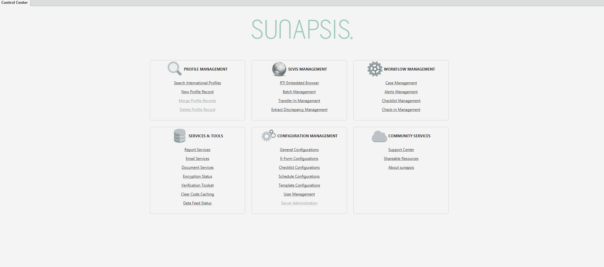
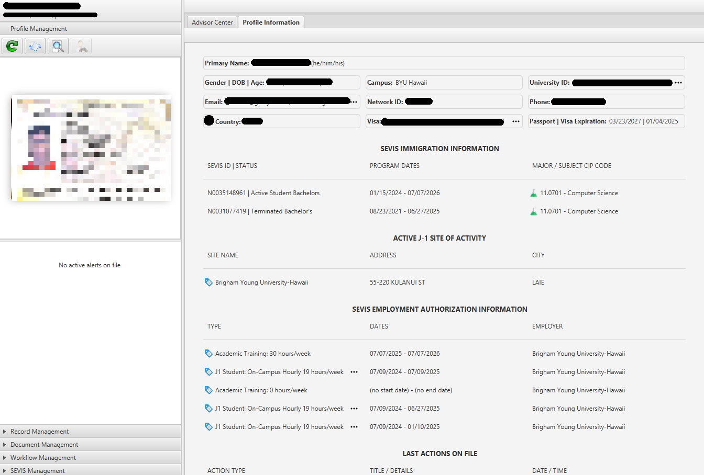
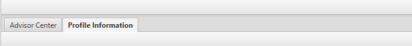
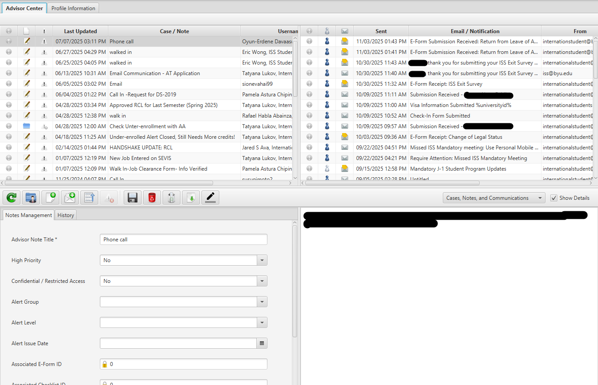
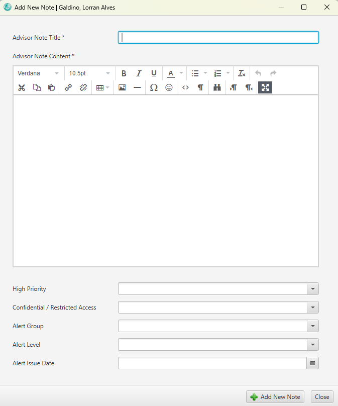

# Viewing Student Profiles

Much of your work in Sunapsis will involve individual student cases. Whether you're cross-referencing information, updating records, checking documentation, or assisting students during office hours, you'll need to access their student profiles regularly.

## Searching for a Student

To locate a student profile:

1. Navigate to the **Profile Management** section
2. Select **Search International Profiles**
3. Enter either the student's name or student ID
4. Press search to pull up their profile

## Understanding the Profile Page

Once you've accessed a student's profile, you'll see the following layout:

### Left Side
- Student's passport photo

### Main Screen (Right Side)
General information including:
- Full name
- Gender
- Date of birth
- Age
- Country of citizenship
- Visa status
- Passport information
- Employment authorization
- Additional biographical details

## Navigating Profile Sections

At the top of the profile page, you'll notice two main sections:

### Profile Information
This is the default view showing all the biographical and status information described above.

### Advisor Center
Click this tab to access:
- **Email correspondence** (displayed on the right)
- **Notes and interactions** (displayed on the left)

## Documenting Student Interactions

:::important
All correspondence with students through email, walk-ins, or phone calls must be documented as notes for record-keeping purposes.
:::

### Creating a New Note

1. Click on **Create New Note** in the Advisor Center
2. Write the details of the exchange or interaction
3. Click **Save as New Note**

This documentation is crucial for maintaining a complete history of all student interactions and ensuring continuity of service.