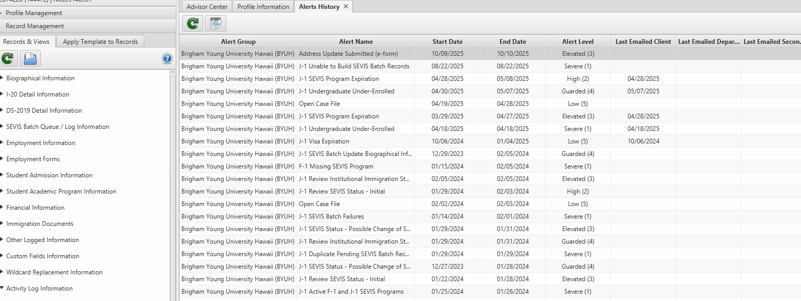

# Workflow Management

## Overview

Workflow management is the system where e-forms are reviewed and either approved or denied. Its primary purpose is to populate student records based on the various e-forms that students submit, including Travel registry forms, Dependent e-forms, DS-2019 extensions, and other institutional forms.

## How It Works

When a student completes an e-form, it enters the workflow management system with all the information they provided. The e-forms are configured with automation capabilities that streamline the data entry process.

### Automated Data Population

After a worker verifies that:
- The student's submitted information is accurate
- All required documents are correct and complete

Upon approval, the system automatically:
- Uploads the information to the appropriate areas within Sunapsis
- Updates the relevant student tables
- Eliminates the need for manual data entry across multiple categories

This automation significantly reduces the time workers spend manually locating fields and transcribing information.

## Email Notifications

Both approval and denial actions trigger automatic email notifications to students. The system supports:

- **Generic templates** - Standard approval or denial messages
- **Specialized templates** - Customized messages for specific form types

Workers can add additional information to these emails to:
- Clarify the decision
- Provide next steps
- Request additional documentation if needed

<!--  -->

## Advanced Features

### Manual Template Application

More advanced functionality, such as manually applying templates, is reserved for special cases like batch processing.

For detailed information about batch processing, please refer to the [Batching Process Documentation](link-to-batching-docs).

:::tip[Best Practices]

- Always verify student information thoroughly before approval
- Review all attached documents for completeness
- Use specialized email templates when additional context is needed
- Reserve manual template application for appropriate scenarios

:::
