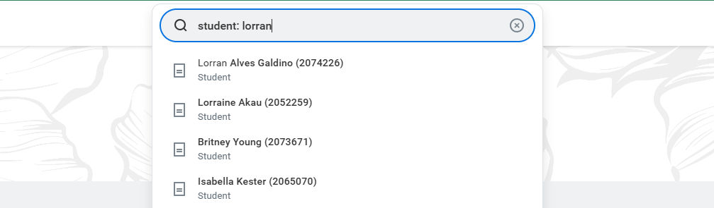

# Initial Access & Searching for Students

Most tasks will have office workers working on individual students. Properly searching for students in Workday is crucial to accessing the correct information.

## The `student:` Command

:::danger IMPORTANT: Always Use student:
When searching for any student, you **must** write `student:` before their name in the search bar.
:::

*Example: Searching with the `student:` prefix*

This pulls up the base student profile as seen by your department with all relevant ISS information.

## Why This Matters

### Searching WITH `student:`
- Shows the student profile with ISS-relevant information
- Displays data your department has access to
- Correct view for daily operations

### Searching WITHOUT `student:`
If you are looking at the tenant or test site that is not fully live yet, searching a student's name **without** the initial `student:` command will cause issues:

- Shows their HR profile instead
- May display information your department cannot see (which you may conflate with having access to)
- May have missing information that only your department would see

*Display: HR profile*

:::warning Best Practice
**Always use the `student:` tag when entering a profile** to ensure you're viewing the correct information.
:::

## Next Steps

Now that you know how to search for students, let's explore the [Student Summary Page](./student-summary).